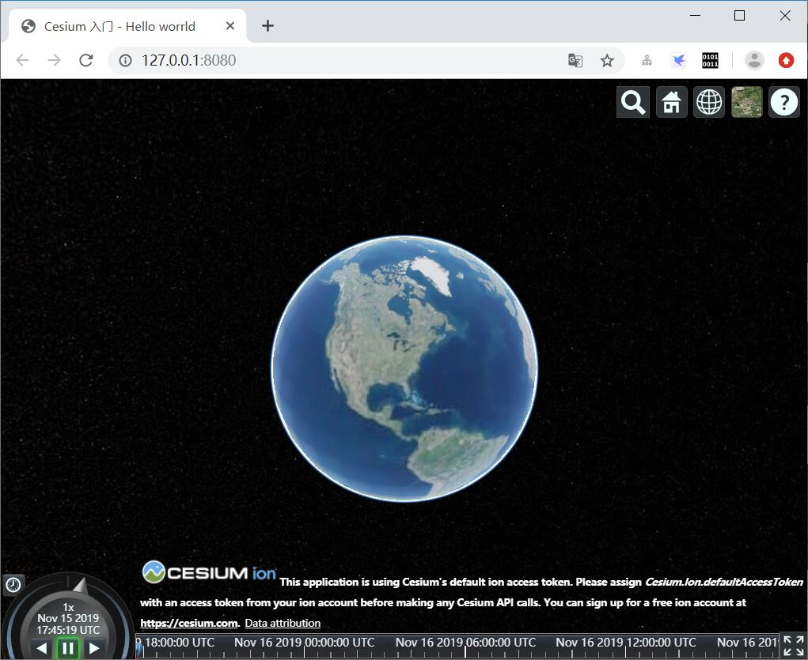
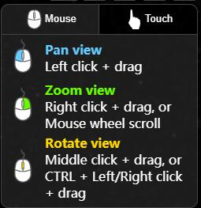
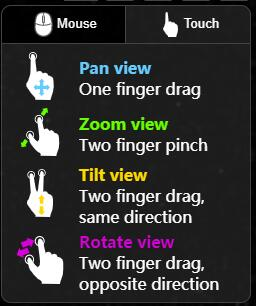

# Viewer 以及一些有用的组件

在前面我们创建了[第一个简单的cesium应用Hello world](01-hello-world.md),如下图：



[在线预览](https://sogrey.github.io/Cesium-start-Example/hello-world.html)

而我们的代码仅仅一行:

``` js
var viewer = new Cesium.Viewer("cesiumContainer");
```

这是我们接触到的第一个cesium API,也是最基础的。

## 创建viewer

任何Cesium应用的基础都是Viewer, 一个交互的三维地球仪。创建一个Viewer，并指定一个id为`cesiumContainer`的div容器，cesium将在该容器中创建画布，绘制渲染三维场景。

``` js
var viewer = new Cesium.Viewer("cesiumContainer");
```
默认，场景能够处理鼠标和触控输入事件，如相机控制:

- 鼠标左键单击和拖动 - 在地球表面移动相机.
- 鼠标右键单击和拖动 - 放大、缩小(相机拉近或拉远)
- 鼠标中键滚轮 - 放大、缩小
- 鼠标中键单击和拖动 - 以地球表面某个点旋转相机

触控事件：

- 一个手指拖曳- 平移视图(One finger drag - Pan view)
- 两个手指捏放- 缩放视图(Two finger pinch - Zoom view)
- 两个手指拖曳，相同方向- 俯仰视图(Two finger drag, same direction - Tilt view)
- 两个手指拖曳，相反方向- 旋转视图(Two finger drag, opposite direction - Rotate view)

 

## Viewer的一些有用的组件

观察场景我们发现除了中心一个地球仪外，还有很多有用的组件。


1. [Geocoder](https://cesium.com/docs/cesiumjs-ref-doc/Geocoder.html) 地名搜索 : 地名搜索工具，相机飞行到查询地点. 默认使用Bing Maps数据.
2. [HomeButton](https://cesium.com/docs/cesiumjs-ref-doc/HomeButton.html) 默认视图 : 视图复位，回到默认视图.
3. [SceneModePicker](https://cesium.com/docs/cesiumjs-ref-doc/SceneModePicker.html) 场景模式 : 切换模式3D, 2D 或2.5D (Columbus View).
4. [BaseLayerPicker](https://cesium.com/docs/cesiumjs-ref-doc/BaseLayerPicker.html) 基础图层 : 选择影像或地形图层.
5. [NavigationHelpButton](https://cesium.com/docs/cesiumjs-ref-doc/NavigationHelpButton.html) 帮助 : 帮助，提供默认相机控制方法.
6. [Animation](https://cesium.com/docs/cesiumjs-ref-doc/Animation.html) 动画 : 控制动画播放速度.
7. [CreditsDisplay](https://cesium.com/docs/cesiumjs-ref-doc/CreditDisplay.html) 鸣谢 : 显示数据归属.
8. [Timeline](https://cesium.com/docs/cesiumjs-ref-doc/Timeline.html) 时间线 : 指示当前时间，允许用户跳到指定时间.
9. [FullscreenButton](https://cesium.com/docs/cesiumjs-ref-doc/FullscreenButton.html) 全屏 : 全屏.

我们之前仅一行代码创建了这个场景，实际上是采用了默认配置，查看API文档[Viewer doc](https://cesium.com/docs/cesiumjs-ref-doc/Viewer.html),`Viewer`有两个参数，第一个是我们已经使用过的`container`，传入一个指定容器的id；第二个是配置，以上提到的组件均可在这配置显示与否。

若要去除左下角和右上角的其他标注或按钮，直接修改option的参数：

``` js
var defaultOption = {
	animation:false,//左下角控制动画            
	baseLayerPicker:false,//右上角图层选择器            
	fullscreenButton:false,  //右下角全屏按钮          
	geocoder:false,//右上角搜索            
	homeButton:false, //home键，点击回到默认视角
	infoBox:false, //点击模型不显示cesium自带的信息框
	//scene3DOnly:false,//仅仅显示3d,可隐藏右上角2d和3d按钮 
	selectionIndicator: false, //点击模型不显示cesium自带的绿色选中框  
	timeline:false,//最下面时间轴            
	navigationHelpButton:false,//右上角帮助按钮 
	navigationInstructionsInitiallyVisibl:false,
	useDefaultRenderLoop:true,            
	showRenderLoopErrors:true,            
	projectionPicker:false,//投影选择器
};
var viewer = new Cesium.Viewer("cesiumContainer", defaultOption);
```

查看[这里](https://sogrey.github.io/Cesium-start-Example/examples/Viewer-some-helpful-widgets.html)

## 去除版权信息

js 方式：

``` js
viewer._cesiumWidget._creditContainer.parentNode.removeChild(
    viewer._cesiumWidget._creditContainer); //去掉版权信息
```

或

``` js
viewer._cesiumWidget._creditContainer.style.display = "none"; //去掉版权信息
```

css方式：

``` js
.cesium-widget-credits{
    display:none !important;
}
```

## Cesium ion
Cesium ion是一个三维数据切片和存储的平台，这里使用ion平台上存储的Sentinal-2 影像和Cesium World Terrain.
需要访问[https://cesium.com/ion/](https://cesium.com/ion/) 注册一个免费账户，并在Access Tokens页面创建访问令牌.
Cesium ion默认提供5GB存储空间.

在创建viewer之前设置访问令牌：

``` js
Cesium.Ion.defaultAccessToken = '<YOUR ACCESS TOKEN HERE>';
```

## 添加影像图层

Cesium支持影像图层的添加、删除、排序、调整.

每个图层的亮度(brightness)、对比度(contrast)、灰度(gamma)、色相(Hue)、 饱和度(Saturation)都支持动态调整.

Cesium提供影像图层操作的很多方法，包括颜色调整(color adjustment)、图层混合(layer blending)等. 代码示例：

- [添加基础影像](https://cesiumjs.org/Cesium/Build/Apps/Sandcastle/index.html?src=Imagery%20Layers.html)
- [调整影像颜色](https://cesiumjs.org/Cesium/Build/Apps/Sandcastle/index.html?src=Imagery%20Adjustment.html)
- [影像图层控制和排序](https://cesiumjs.org/Cesium/Build/Apps/Sandcastle/index.html?src=Imagery%20Layers%20Manipulation.html)
- [Splitting imagery layers](https://cesiumjs.org/Cesium/Build/Apps/Sandcastle/index.html?src=Imagery%20Layers%20Split.html)

Cesium提供了多个影像图层提供者，包括：

- WMS -  OGC标准，[WebMapServiceImageryProvider](https://cesiumjs.org/Cesium/Build/Documentation/WebMapServiceImageryProvider.html) 
- TMS - 访问地图瓦片的REST接口，可以使用[MapTiler](http://www.maptiler.org/) or [GDAL2Tiles](http://www.klokan.cz/projects/gdal2tiles/). I
   生成，参见[createTileMapServiceImageryProvider](https://cesiumjs.org/Cesium/Build/Documentation/createTileMapServiceImageryProvider.html) 
- WMTS(with time dynamic imagery) -OGC标准，  [WebMapTileServiceImageryProvider](https://cesiumjs.org/Cesium/Build/Documentation/WebMapTileServiceImageryProvider.html) 
- ArcGIS -  [ArcGIS Server REST API](http://resources.esri.com/help/9.3/arcgisserver/apis/rest/) ，见 [ArcGisMapServerImageryProvider](https://cesiumjs.org/Cesium/Build/Documentation/ArcGisMapServerImageryProvider.html) 
- Bing Maps -[Bing Maps REST Services](http://msdn.microsoft.com/en-us/library/ff701713.aspx)
   ，需要[Bing Maps key](https://www.bingmapsportal.com/), [BingMapsImageryProvider](https://cesiumjs.org/Cesium/Build/Documentation/BingMapsImageryProvider.html) 
- Google Earth -[Google Earth Enterprise server](http://www.google.com/enterprise/mapsearth/products/earthenterprise.html)发布的数据， 见[GoogleEarthEnterpriseImageryProvider](https://cesiumjs.org/Cesium/Build/Documentation/GoogleEarthEnterpriseImageryProvider.html) 
- Mapbox - 需要token, [MapboxImageryProvider](https://cesiumjs.org/Cesium/Build/Documentation/MapboxImageryProvider.html) 
- Open Street Map -访问OSM或[Slippy map tiles](http://wiki.openstreetmap.org/wiki/Slippy_map_tilenames)
   ，参见 [createOpenStreetMapImageryProvider](https://cesiumjs.org/Cesium/Build/Documentation/createOpenStreetMapImageryProvider.html) 
- Cesium Ion平台 - [IonImageryProvider](https://cesiumjs.org/Cesium/Build/Documentation/IonImageryProvider.html) 

其他内置影像图层提供者

- [GridImageryProvider](https://cesiumjs.org/Cesium/Build/Documentation/GridImageryProvider.html)
- [ImageryProvider](https://cesiumjs.org/Cesium/Build/Documentation/ImageryProvider.html)
-  [SingleTileImageryProvider](https://cesiumjs.org/Cesium/Build/Documentation/SingleTileImageryProvider.html) - 从一张图片中创建瓦片
- [TileCoordinatesImageryProvider](https://cesiumjs.org/Cesium/Build/Documentation/TileCoordinatesImageryProvider.html)
-  [UrlTemplateImageryProvider](https://cesiumjs.org/Cesium/Build/Documentation/UrlTemplateImageryProvider.html) - 自定义瓦片切片方案，如`//cesiumjs.org/tilesets/imagery/naturalearthii/{z}/{x}/{reverseY}.jpg`.

当然，也可以通过实现[[ImageryProvider接口](https://cesiumjs.org/Cesium/Build/Documentation/ImageryProvider.html) 定义新的影像接入方式。

举例，加载[GoogleEarthEnterpriseImageryProvider](https://cesium.com/docs/cesiumjs-ref-doc/GoogleEarthEnterpriseImageryProvider.html):

``` js
var geeMetadata = new GoogleEarthEnterpriseMetadata('http://www.earthenterprise.org/3d');
var gee = new Cesium.GoogleEarthEnterpriseImageryProvider({
    metadata : geeMetadata
});

var viewer = new Cesium.Viewer("cesiumContainer",{
    baseLayerPicker:false,//关闭基本图层
    imageryProvider:gee,
});
```

加载谷歌卫星影像：

``` js
var google=new Cesium.UrlTemplateImageryProvider({
	url:'http://www.google.cn/maps/vt?lyrs=s@800&x={x}&y={y}&z={z}',  
	tilingScheme:new Cesium.WebMercatorTilingScheme(), 
	minimumLevel:1,            
	maximumLevel:20        
}); 
var viewer = new Cesium.Viewer("cesiumContainer",{
    baseLayerPicker:false,//关闭基本图层
    imageryProvider:google,
});
```

加载arcGis:

``` js
var viewer = new Cesium.Viewer("cesiumContainer", {
    baseLayerPicker: false, //关闭基本图层
    imageryProvider: new Cesium.ArcGisMapServerImageryProvider({
        url: 'https://services.arcgisonline.com/ArcGIS/rest/services/World_Imagery/MapServer'
    }),
});
```

Cesium加载全球地形图:

``` js
 var terrain=new Cesium.createWorldTerrain({           
         requestWaterMask:true,           
         requestVertexNormals:true       
  });        
 viewer.terrainProvider=terrain;//加入世界地形图
```

高德影像底图:

``` js
viewer = new Cesium.Viewer("cesiumContainer", {
    animation: false, //是否显示动画控件
    baseLayerPicker: false, //是否显示图层选择控件
    geocoder: true, //是否显示地名查找控件
    timeline: false, //是否显示时间线控件
    sceneModePicker: true, //是否显示投影方式控件
    navigationHelpButton: false, //是否显示帮助信息控件
    infoBox: true, //是否显示点击要素之后显示的信息
    imageryProvider: new Cesium.UrlTemplateImageryProvider({
        url: "https://webst02.is.autonavi.com/appmaptile?style=6&x={x}&y={y}&z={z}",
        //layer: "tdtVecBasicLayer",
        //style: "default",
        //format: "image/png",
        //tileMatrixSetID: "GoogleMapsCompatible",
        //show: false
    })
});
viewer.imageryLayers.addImageryProvider(new Cesium.UrlTemplateImageryProvider({
    url: "http://webst02.is.autonavi.com/appmaptile?x={x}&y={y}&z={z}&lang=zh_cn&size=1&scale=1&style=8",
    //layer: "tdtAnnoLayer",
    //style: "default",
    //format: "image/jpeg",
    //tileMatrixSetID: "GoogleMapsCompatible"
}));
```

高德街道底图:

``` js
viewer = new Cesium.Viewer("cesiumContainer", {
    animation: false, //是否显示动画控件
    baseLayerPicker: false, //是否显示图层选择控件
    geocoder: true, //是否显示地名查找控件
    timeline: false, //是否显示时间线控件
    sceneModePicker: true, //是否显示投影方式控件
    navigationHelpButton: false, //是否显示帮助信息控件
    infoBox: true, //是否显示点击要素之后显示的信息
    imageryProvider: new Cesium.UrlTemplateImageryProvider({
        url: "http://webrd02.is.autonavi.com/appmaptile?lang=zh_cn&size=1&scale=1&style=8&x={x}&y={y}&z={z}",
        //layer: "tdtVecBasicLayer",
        //style: "default",
        //format: "image/png",
        //tileMatrixSetID: "GoogleMapsCompatible",
        //show: false
    })
});
viewer.imageryLayers.addImageryProvider(new Cesium.UrlTemplateImageryProvider({
    url: "http://webst02.is.autonavi.com/appmaptile?x={x}&y={y}&z={z}&lang=zh_cn&size=1&scale=1&style=8",
    //layer: "tdtAnnoLayer",
    //style: "default",
    //format: "image/jpeg",
    //tileMatrixSetID: "GoogleMapsCompatible"
}));
```

更多影像地图查看[国家地理信息公共服务平台](https://service.tianditu.gov.cn/)

## 配置地形

Viewer除了`imageryProvider`影像外，还有`terrainProvider`地形，默认为[EllipsoidTerrainProvider](https://cesium.com/docs/cesiumjs-ref-doc/EllipsoidTerrainProvider.html?classFilter=EllipsoidTerrainProvider)

举例：

``` js
// Create Cesium World Terrain with default settings
var viewer = new Cesium.Viewer('cesiumContainer', {
    terrainProvider : Cesium.createWorldTerrain();
});
```

``` js
// Create Cesium World Terrain with water and normals.
var viewer = new Cesium.Viewer('cesiumContainer', {
    terrainProvider : Cesium.createWorldTerrain({
        requestWaterMask : true,
        requestVertexNormals : true
    });
});
```

## 配置场景

将场景配置为基于太阳的位置启用照明。

``` js
// Enable lighting based on sun/moon positions
viewer.scene.globe.enableLighting = true;
```
这将使我们场景中的照明随一天的时间而变化。如果缩小，您会看到地球的一部分很暗，因为太阳已经落在世界的那一部分。

一些基本的Cesium类型:

- [`Cartesian3`](https://cesium.com/docs/cesiumjs-ref-doc/Cartesian3.html) ：3D直角坐标–使用地球固定框架（ECEF）相对于地球中心（以米为单位）时，
- [`Cartographic`](https://cesium.com/docs/cesiumjs-ref-doc/Cartographic.html) ：由经度，纬度（以弧度表示）和距WGS84椭球面的高度定义的位置
- [`HeadingPitchRoll`](https://cesium.com/docs/cesiumjs-ref-doc/HeadingPitchRoll.html)：围绕东西向北框架中的局部轴的旋转（以弧度为单位）。航向是绕负z轴的旋转。螺距是绕负y轴的旋转。滚动是绕正x轴的旋转。
- [`Quaternion`](https://cesium.com/docs/cesiumjs-ref-doc/Quaternion.html) ：表示为4D坐标的3D旋转。

## 相机控制

该[`Camera`](https://cesium.com/docs/cesiumjs-ref-doc/Camera.html)是的属性[`viewer.scene`](https://cesium.com/docs/cesiumjs-ref-doc/Scene.html) 和控制什么是目前可见的。我们可以直接设置摄像机的位置和方向，也可以使用Cesium Camera API来控制摄像机，该API旨在指定摄像机随时间的位置和方向。

一些最常用的方法是：

- [`Camera.setView(options)`](https://cesium.com/docs/cesiumjs-ref-doc/Camera.html#setView) ：立即将相机设置在特定的位置和方向
- [`Camera.zoomIn(amount)`](https://cesium.com/docs/cesiumjs-ref-doc/Camera.html#zoomIn) ：沿着视图矢量向前移动相机
- [`Camera.zoomOut(amount)`](https://cesium.com/docs/cesiumjs-ref-doc/Camera.html#zoomOut) ：沿着视图矢量向后移动相机
- [`Camera.flyTo(options)`](https://cesium.com/docs/cesiumjs-ref-doc/Camera.html#flyTo) ：创建从当前摄像机位置到新位置的动画摄像机飞行
- [`Camera.lookAt(target, offset)`](https://cesium.com/docs/cesiumjs-ref-doc/Camera.html#lookAt) ：定位和定位相机，以给定偏移量瞄准目标点
- [`Camera.move(direction, amount)`](https://cesium.com/docs/cesiumjs-ref-doc/Camera.html#move) ：沿任何方向移动相机
- [`Camera.rotate(axis, angle)`](https://cesium.com/docs/cesiumjs-ref-doc/Camera.html#rotate) ：围绕任何轴旋转相机

要了解API的功能，请查看以下相机演示：

- [相机API演示](https://sandcastle.cesium.com/?src=Camera.html&label=Tutorials)
- [自定义相机控件演示](https://sandcastle.cesium.com/?src=Camera%20Tutorial.html&label=Tutorials)

让我们将相机移至纽约，尝试其中一种方法。[`camera.setView()`](https://cesium.com/docs/cesiumjs-ref-doc/Camera.html)使用`Cartesian3`和设置初始视图，使用a 和a `HeadingPitchRoll`来定位和定向：

``` js
// Create an initial camera view
var initialPosition = new Cesium.Cartesian3.fromDegrees(-73.998114468289017509, 40.674512895646692812, 2631.082799425431);
var initialOrientation = new Cesium.HeadingPitchRoll.fromDegrees(7.1077496389876024807, -31.987223091598949054, 0.025883251314954971306);
var homeCameraView = {
    destination : initialPosition,
    orientation : {
        heading : initialOrientation.heading,
        pitch : initialOrientation.pitch,
        roll : initialOrientation.roll
    }
};
// Set the initial view
viewer.scene.camera.setView(homeCameraView);
```

现在将摄像机定位并定向为向下看向曼哈顿，并且我们的视图参数保存在一个对象中，我们可以将其传递给其他摄像机方法。

实际上，我们可以使用同一视图来更新按下主屏幕按钮的效果。与其让我们从远处返回到地球的默认视图，不如覆盖按钮以将我们带到曼哈顿的初始视图。我们可以通过添加更多选项来调整动画，然后添加事件监听器以取消默认排期，并调用`flyTo()`新的主视图：

``` js
// Add some camera flight animation options
homeCameraView.duration = 2.0;
homeCameraView.maximumHeight = 2000;
homeCameraView.pitchAdjustHeight = 2000;
homeCameraView.endTransform = Cesium.Matrix4.IDENTITY;
// Override the default home button
viewer.homeButton.viewModel.command.beforeExecute.addEventListener(function (e) {
    e.cancel = true;
    viewer.scene.camera.flyTo(homeCameraView);
});
```

有关基本相机控制的更多信息，请查看官方的[相机教程](https://cesium.com/docs/tutorials/camera/)。

## 时钟控制

配置查看器[`Clock`](https://cesium.com/docs/cesiumjs-ref-doc/Clock.html?classFilter=clock) 并[`Timeline`](https://cesium.com/docs/cesiumjs-ref-doc/Timeline.html?classFilter=timeline)控制场景中时间的流逝。

[Clock API](https://sandcastle.cesium.com/?src=Clock.html&label=Showcases)

当使用特定时间时，Cesium使用该[`JulianDate`](https://cesium.com/docs/cesiumjs-ref-doc/JulianDate.html)类型，该类型存储自1月1日正午-4712（公元前4713年）以来的天数。为了提高精度，此类将日期的整数部分和日期的秒数部分存储在单独的组件中。为了安全进行算术运算并表示leap秒，该日期始终存储在国际原子时间标准中。

这是我们如何设置场景时间选项的示例：

```js
// Set up clock and timeline.
viewer.clock.shouldAnimate = true; // make the animation play when the viewer starts
viewer.clock.startTime = Cesium.JulianDate.fromIso8601("2017-07-11T16:00:00Z");
viewer.clock.stopTime = Cesium.JulianDate.fromIso8601("2017-07-11T16:20:00Z");
viewer.clock.currentTime = Cesium.JulianDate.fromIso8601("2017-07-11T16:00:00Z");
viewer.clock.multiplier = 2; // sets a speedup
viewer.clock.clockStep = Cesium.ClockStep.SYSTEM_CLOCK_MULTIPLIER; // tick computation mode
viewer.clock.clockRange = Cesium.ClockRange.LOOP_STOP; // loop at the end
viewer.timeline.zoomTo(viewer.clock.startTime, viewer.clock.stopTime); // set visible range
```

这将设置场景动画的速率，开始和停止时间，并在达到停止时间时告诉时钟返回到开始。还将时间线小部件设置为适当的时间范围。查看此[时钟示例代码](https://sandcastle.cesium.com/?src=Clock.html&label=All)以尝试时钟设置。


## 参考

- [https://cesium.com/docs/tutorials/cesium-workshop/#creating-the-viewer](https://cesium.com/docs/tutorials/cesium-workshop/#creating-the-viewer)
- [https://www.jianshu.com/p/f66caf4cb43f](https://www.jianshu.com/p/f66caf4cb43f)
