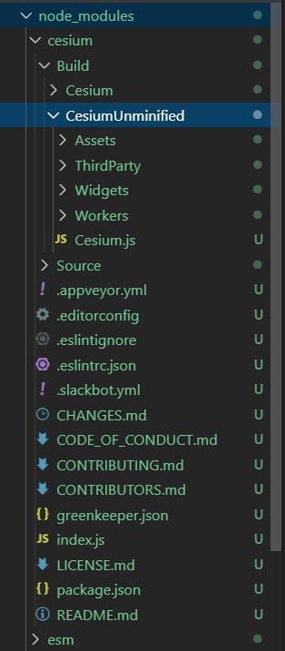

# 简介及环境配置

::: tip Cesium是什么？
Cesium ['siːzɪəm]是JavaScript开源库，通过Cesium，实现无插件的创建三维球和二维地图。它是通过WebGL技术实现图形的硬件加速，并且跨平台，跨浏览器，并提供动态数据的可视化展现。
:::

## cesium 功能

- 使用3d tiles 格式流式加载各种不同的3d数据，包含倾斜摄影模型、三维建筑物、CAD和BIM的外部和内部，点云数据。并支持样式配置和用户交互操作。
- 全球高精度地形数据可视化，支持地形夸张效果、以及可编程实现的等高线和坡度分析效果。
- 支持多种资源的图像图层，包括WMS，TMS，WMTS以及时序图像。图像支持透明度叠加、亮度、对比度、GAMMA、色调、饱和度都可以动态调整。支持图像的卷帘对比。
- 支持标准的矢量格式KML、GeoJSON、TopoJSON，以及矢量的贴地效果。
- 三维模型支持gltf2.0标准的PBR材质、动画、蒙皮和变形效果。贴地以及高亮效果。
- 使用CZML支持动态时序数据的展示。
- 支持各种几何体：点、线、面、标注、公告牌、立方体、球体、椭球体、圆柱体、走廊(corridors)、管径、墙体
- 可视化效果包括：基于太阳位置的阴影、自身阴影、柔和阴影。
  大气、雾、太阳、阳光、月亮、星星、水面。
- 粒子特效：烟、火、火花。
- 地形、模型、3d tiles模型的面裁剪。
- 对象点选和地形点选。
- 支持鼠标和触摸操作的缩放、渲染、惯性平移、飞行、任意视角、地形碰撞检测。
- 支持3d地球、2d地图、2.5d哥伦布模式。3d视图可以使用透视和正视两种投影方式。
- 支持点、标注、公告牌的聚集效果。

资料:

- [cesium官网](https://cesium.com/)
- [cesium github](https://github.com/AnalyticalGraphicsInc/cesium)

更多参考资料见[参考资料](../reference/)

---

开始cesium前，先下载cesium源码，可以从官方网站[下载](https://cesium.com/downloads/)也可以到[cesium github](https://github.com/AnalyticalGraphicsInc/cesium) clone。

需要安装[node.js](https://nodejs.org/en/)

## 编译源码

js是解释型语言，本不需要编译。但cesium是由众多模块组成，编译是为了把cesium各个模块源码打包生成统一cesium.js，对于cesium的打包命令见[Cesium打包命令总结](https://zhuanlan.zhihu.com/p/47588567)。

``` bash
npm install #安装cesium开发和运行中依赖的第三方node.js包
```

``` bash
npm run release #创建`Build`目录，把cesium各个模块源码打包生成统一cesium.js，生成文档
```

``` bash
npm start #开启一个本地http server
```

执行完会提示打开一个本地http地址：

> Cesium development server running locally.  Connect to http://localhost:8080/

其中：

- [Sandcastle](http://localhost:8080/Apps/Sandcastle/index.html) [在线地址](https://sandcastle.cesium.com/) 包含众多cesium示例，开发者经常光顾
- [Documentation](http://localhost:8080/Build/Documentation/index.html) [在线地址](https://cesium.com/docs/cesiumjs-ref-doc/) cesium API文档，开发必备

---

我这里选择基于node依赖安装，前提需要安装[node](https://nodejs.org/en/)。

IDE:[Visual Studio Code](https://code.visualstudio.com/)

服务器:[live-server](https://sogrey.github.io/Plug-in/guide.html#live-server-编辑浏览html网页) (基于node)

先执行

``` bash
npm init
```

配置生成`package.json`:

```bash
Administrator@WIN-IQLNPTL95TO MINGW64 /e/workspace/Gis/sogrey/Cesium-start-Example (master)
$ npm init
This utility will walk you through creating a package.json file.
It only covers the most common items, and tries to guess sensible defaults.

See `npm help json` for definitive documentation on these fields
and exactly what they do.

Use `npm install <pkg>` afterwards to install a package and
save it as a dependency in the package.json file.

Press ^C at any time to quit.
package name: (cesium-start-example)
version: (1.0.0)
description: cesium 入门示例
entry point: (index.js)
test command:
git repository: (https://github.com/Sogrey/Cesium-start-Example.git)
keywords: cesium examples
author: Sogrey
license: (ISC) MIT
About to write to E:\workspace\Gis\sogrey\Cesium-start-Example\package.json:

{
  "name": "cesium-start-example",
  "version": "1.0.0",
  "description": "cesium 入门示例",
  "main": "index.js",
  "scripts": {
    "test": "echo \"Error: no test specified\" && exit 1"
  },
  "repository": {
    "type": "git",
    "url": "git+https://github.com/Sogrey/Cesium-start-Example.git"
  },
  "keywords": [
    "cesium",
    "examples"
  ],
  "author": "Sogrey",
  "license": "MIT",
  "bugs": {
    "url": "https://github.com/Sogrey/Cesium-start-Example/issues"
  },
  "homepage": "https://github.com/Sogrey/Cesium-start-Example#readme"
}

Is this OK? (yes) y
```

如上，学习过程中的示例存放在[Cesium-start-Example](https://github.com/Sogrey/Cesium-start-Example.git)，再执行

``` bash
npm i cesium
```

安装cesium依赖，完成后自动多出一个目录`node_modules`。查看`node_modules` 下 `cesium` 的目录结构：



其中

- `Build`目录下是打包后的，
  - `Cesium`目录下是压缩好的，用于生产
  - `CesiumUnminified`是未压缩的，可用于开发调试
- `Source` 为源码

自此，环境配置就基本完成了。

